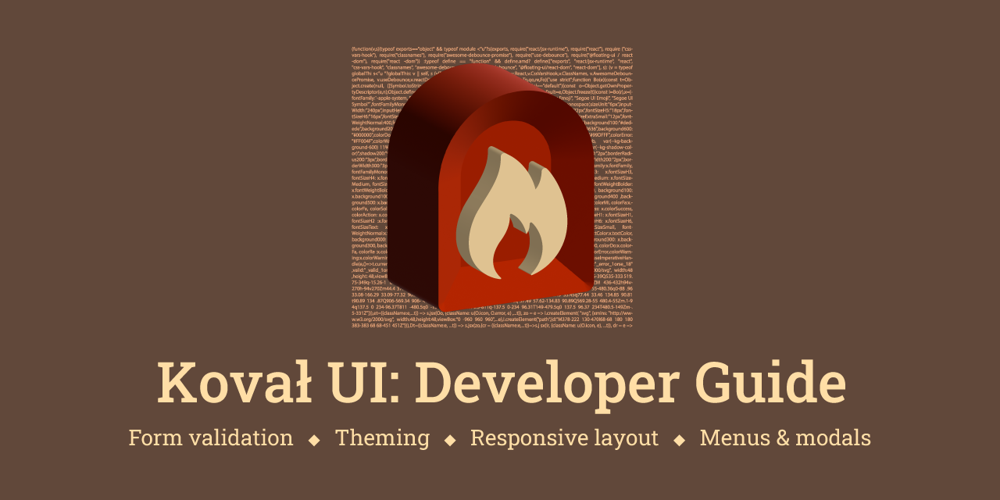

import {Callout} from 'nextra/components';

# Koval UI: Developer Guide

**Koval UI** is a collection of React components (aka design library).

<Callout type="info" emoji="🇺🇦">
    _Koval_ (`koválʹ`) is a _smith_ in Ukrainian language. See [vocabulary
    definition](https://en.wiktionary.org/wiki/%D0%BA%D0%BE%D0%B2%D0%B0%D0%BB%D1%8C).
</Callout>

See [Koval Storybook](https://morewings.github.io/koval-ui/).

## Features

- **Theming**. Easy configurable color themes.
- **Responsive layout**.
- Provides **variety of user input** capture components (e.g. `InputText`, `InputColor`, e.t.c.).
- Input components are **compatible with most form/input validation libraries** (e.g. `react-hook-form`).
- Has flexible **built-in input validation**.
- Menu, Dialog, Tooltip and other **floating components** available.
